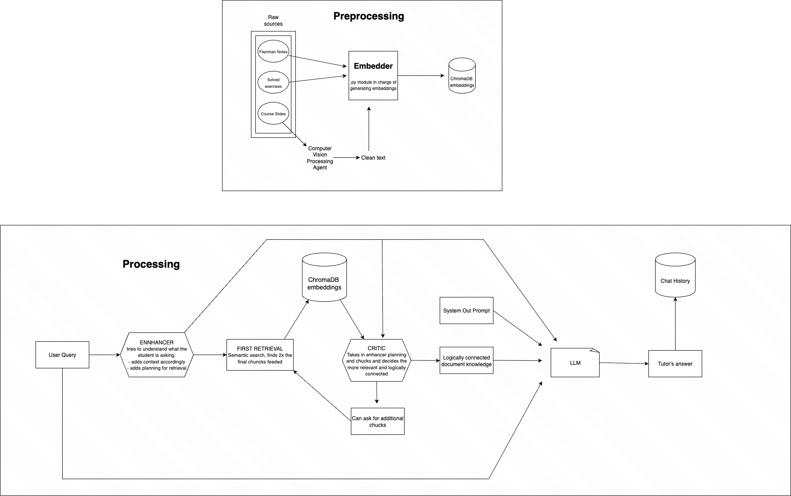

# Rick: AI Electromagnetism Tutor
An agentic RAG pipeline that teaches electromagnetism by understanding student questions, retrieving relevant textbook content, and delivering personalized explanations.<br>
Status: MVP complete with evaluation framework.

## Architecture
The system uses a multi-agent approach with iterative refinement:
<div align="center">

</div>

### Key Design Choices
**Why agents?** Breaking down the RAG pipeline into specialized agents improves both retrieval quality and pedagogical effectiveness. <br>
**Why iterative refinement?** The Critic's confidence score triggers additional retrieval when initial chunks are insufficient, balancing quality with API costs.<br>
**Why parallel experts?** The Enhancer runs 4 LLM calls in parallel to understand different aspects of the question simultaneously.<br>

---

## Components

### 1. Preprocessing (`preprocessing.py`)

Converts PDF textbooks into a searchable vector database.

**Process:**
- Extracts text from PDFs page-by-page
- Splits into 512-character chunks (overlap: 128 chars)
- Generates embeddings using `all-MiniLM-L6-v2`
- Stores in ChromaDB with source/page metadata

**Key parameters:**
- `chunk_size=512`: Larger chunks preserve physics context
- `batch_size=12`: Memory-efficient processing (~8GB RAM)

**Usage:**
```python
from preprocessing import process_and_store

process_and_store(
    pdf_folder="docs/",
    vector_db_path="chromadb/chroma_db",
    batch_size=12
)
```

---

### 2. Enhancer (`enhancer.py`)

Analyzes user questions to optimize both retrieval and teaching approach.

**Four parallel experts:**
1. **Semantic Expert** - Identifies learning needs (e.g., "needs intuition, not just formulas")
2. **Physics Expert** - Extracts core concepts and background knowledge
3. **Prerequisite Expert** - Identifies required math/physics foundations
4. **Query Reformulation Expert** - Generates 2-3 optimized search queries

**Returns:**
```python
{
    'query': str,                    # Original question
    'for_retrieval': List[str],      # Enhanced search queries
    'for_llm': {                     # Pedagogical context
        'semantic': str,
        'physics': str,
        'prerequisites': str
    }
}
```

**Example:**
```python
enhancer = Enhancer()
result = enhancer.enhance("how does Gauss law work?")

# result['for_retrieval'] might be:
# ["Gauss law for electric fields mathematical formulation",
#  "applying Gauss law with symmetry to calculate fields",
#  "integral form Gauss law closed surface charge"]
```

**Why this matters:** Vague questions like "explain Gauss law" become precise queries that retrieve the right textbook sections.

---

### 3. Critic (`critic.py`)

Filters retrieved chunks down to the most relevant 6-8 pieces.

**Two-stage process:**
1. **Ranking** - Sorts all chunks by relevance (GPT-4o-mini)
2. **Filtering** - Selects optimal subset, eliminates redundancy

**Returns:**
```python
(
    filtered_chunks: List[Tuple[Document, float]],
    metadata: {
        'confidence': float,      # 0.0-1.0: coverage quality
        'reasoning': str,         # Why these chunks?
        'num_selected': int
    }
)
```

**Confidence scoring:**
- `>= 0.7`: Good coverage, proceed to LLM
- `< 0.7`: Trigger additional retrieval

**Usage:**
```python
critic = Critic(
    enhancer_message=enhancer_context,
    chunks=initial_chunks
)
filtered_chunks, metadata = critic.execute()
```

---

### 4. Pipeline (`rag_pipeline.py`)

Orchestrates the full RAG workflow with iterative refinement.

**Execution flow:**

1. **Enhancement** - Understand the question
2. **First Retrieval** - Fetch top 20 chunks using enhanced queries
3. **Refinement Loop** (max 2 attempts):
   - Critic evaluates chunks
   - If confidence < 0.7, fetch 5 more chunks
   - Repeat until confidence threshold met
4. **LLM Generation** - GPT-4o generates personalized answer

**System prompt highlights:**
- Cite sources: `[Source: filename, Page: X]`
- Adapt style based on pedagogical review
- Use LaTeX for math (`$$` display, `$` inline)
- Address misconceptions gently
- List assumed prerequisites at end

**Configuration:**
```python
@dataclass
class PipelineConfig:
    initial_chunk_count: int = 20
    max_refinement_attempts: int = 2
    confidence_threshold: float = 0.7
    llm_model: str = "gpt-4o"
    llm_temperature: float = 0.4
```

**Usage:**
```python
pipeline = Pipeline()
response = pipeline.execute("What is electromagnetic induction?")
print(response.content)  # Full answer with citations
```

---

### 5. Evaluator (`evaluator.py`)

Systematically compares RAG-enhanced answers against baseline LLM responses.

**Judge System:**
Uses GPT-5 as an expert evaluator to score answers on three criteria:

1. **First-Principles Reasoning (40%)** - Does it build from fundamental laws?
2. **Conceptual Comprehensiveness (35%)** - Breadth of connections and context
3. **Clarity and Pedagogical Quality (25%)** - Logical flow and accessibility

**Scoring:**
- `+1.0` - RAG substantially better (clear superiority in 2+ criteria)
- `+0.5` - RAG somewhat better (modest improvement)
- `0.0` - Equivalent or RAG worse

**Test set:** 10 representative electromagnetism questions covering:
- Fundamental laws (Gauss's law, Coulomb's law)
- Problem-solving techniques
- Conceptual understanding
- Mathematical derivations

**Usage:**
```python
from evaluator import Judge, generate_replies

judge = Judge()
question = "Can you explain Gauss's law?"

# Generate both answers
rag_answer, baseline_answer = generate_replies(question)

# Evaluate
score, reasoning = judge.judge_answers(question, rag_answer, baseline_answer)
print(f"Score: {score}")
print(f"Reasoning: {reasoning}")
```

**Running full evaluation:**
```bash
python evaluator.py  # Generates evaluation_report.md with mean score
```

---


## Design Trade-offs

**Multi-agent vs Single LLM:**
- ✅ Better retrieval precision
- ✅ Pedagogically aware responses
- ❌ Higher latency (4 parallel + 2 sequential calls)
- ❌ Increased API costs

**Iterative refinement:**
- ✅ Adapts to question complexity
- ✅ Higher answer quality
- ❌ Variable response times
- ⚖️ Confidence threshold (0.7) balances quality/cost

**Chunk size (512 chars):**
- ✅ Preserves physics derivations
- ✅ Maintains equation context
- ❌ Fewer chunks per textbook
- Alternative: 256 chars for more granular retrieval

---

## Monitoring

The pipeline logs detailed execution metrics:
- Chunk counts at each stage
- Critic confidence scores
- LLM token usage and costs
- Processing times

Enable monitoring by running with console output.

---

## Next Steps

- [ ] Frontend interface (chat UI)
- [ ] Conversation history integration
- [ ] Support for images/diagrams from PDFs
- [ ] Multi-turn clarification dialogues
- [ ] Expand to other physics domains

---

## Technical Stack

- **LLMs:** GPT-4o (main), GPT-4o-mini (agents), GPT-5 (evaluation)
- **Embeddings:** HuggingFace `all-MiniLM-L6-v2`
- **Vector Store:** ChromaDB
- **Framework:** LangChain
- **PDF Processing:** pdfplumber